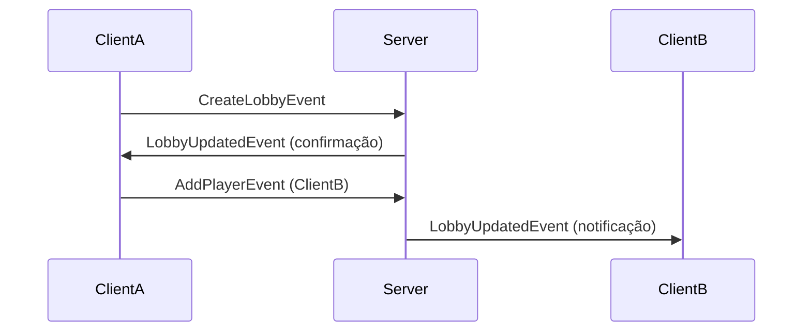

# BYTEFALL project

## LobbyHandler Documentation

### Visão Geral
Sistema de gerenciamento de lobbies com:
- Suporte a até 4 jogadores por lobby
- Seleção de personagens
- Dificuldade customizável
- Notificações em tempo real
- Baseado em UserId para maior confiabilidade

## Estrutura Recomendada (Hierarquia de Pastas)
```text
ReplicatedStorage/  
├── RemoteEvents/  
|   ├── CreateLobbyEvent  
|   ├── AddPlayerEvent  
|   ├── RemovePlayerEvent  
|   ├── DestroyLobbyEvent  
|   ├── SetLobbyDifficultyEvent  
|   └── LobbyUpdatedEvent  
└── RemoteFunctions/  
    ├── GetPlayersFunction  
    └── SetPlayerCharacterEvent  
```
## Estrutura Completa do Lobby
```lua
{
    players = {
        {
            player = Player, -- Objeto do jogador
            userId = 12345, -- UserId do jogador
            position = "Player1", 
            character = "Warrior"
        },
        -- ... outros jogadores
    },
    isFull = true,
    maxPlayers = 4,
    difficulty = "Hard",
    creator = Player -- Objeto do criador
}
```
## Tratamento de Erros Comuns

| Erro | Causa | Solução |
|------|-------|---------|
| "Lobby is full" | Tentativa de adicionar >4 jogadores | Verifique `isFull` antes de adicionar |
| "Only lobby creator can..." | Ação restrita ao criador | Verifique `lobbyInfo.creator` |
| "Player already in lobby" | Jogador duplicado | Verifique `playerToLobby` antes de adicionar |

## Recomendações

1. Sempre verifique `isFull` antes de tentar adicionar jogadores
2. Use UserId para armazenar dados persistentes
3. Limpe listeners de eventos quando destruir o lobby
4. Para sistemas complexos, considere usar um Finite State Machine
## Fluxo de Comunicação


# Adições Necessárias
### Segundo a IA (DeepSeek)
### Server-Side API
```lua
-- Para uso em outros scripts do servidor
local lobbyManager = require(path.to.script)

-- Obter lobby de um jogador
local lobby = lobbyManager:GetLobbyByPlayer(player)

-- Forçar remoção de jogador (útil para moderadores)
lobbyManager:AdminRemovePlayer(targetPlayer)
```
## Customização
Altere estas constantes no script principal:
```lua
local MAX_PLAYERS_PER_LOBBY = 4       -- Máximo de jogadores
local DEFAULT_DIFFICULTY = "Easy"     -- Dificuldade inicial
local DEFAULT_CHARACTER = "None"      -- Personagem padrão
```
## Armazenamento Persistente
Para integrar com DataStores:
```lua
game:BindToClose(function()
    for userId, lobby in pairs(playerToLobby) do
        DataStore:SetAsync(userId, lobby:GetLobbyInfo())
    end
end)
```
## Uso de Funções Úteis
#### Criar um lobby (do LocalScript)
```lua
local ReplicatedStorage = game:GetService("ReplicatedStorage")
local CreateLobbyEvent = ReplicatedStorage:WaitForChild("CreateLobbyEvent")

CreateLobbyEvent:FireServer()
```
#### Adicionar um jogador (do LocalScript)
```lua
local AddPlayerEvent = ReplicatedStorage:WaitForChild("AddPlayerEvent")
-- Adiciona targetPlayer como player2 (ou a próxima posição disponível)
AddPlayerEvent:FireServer(targetPlayer)
```
#### Obtem lista de jogadores com posições
```lua
local GetPlayersFunction = ReplicatedStorage:WaitForChild("GetPlayersFunction")
local playersInfo = GetPlayersFunction:InvokeServer()

for _, info in ipairs(playersInfo) do
    print(info.position .. ": " .. info.player.Name)
end
```
#### Remover um jogador (do LocalScript)
```lua
local RemovePlayerEvent = ReplicatedStorage:WaitForChild("RemovePlayerEvent")
RemovePlayerEvent:FireServer(targetPlayer)
```
#### Obter lista de jogadores (do LocalScript)
```lua
local GetPlayersFunction = ReplicatedStorage:WaitForChild("GetPlayersFunction")
local players = GetPlayersFunction:InvokeServer()
```
#### Selecionar character (LocalScript)
Informação de personagem incluída no retorno de GetPlayersFunction:

Agora cada jogador no lobby tem um campo character com o nome do personagem selecionado

Notificação automática:

Quando um jogador muda de personagem, todos no lobby são notificados via LobbyUpdatedEvent
##### Definir personagem:
```lua
local ReplicatedStorage = game:GetService("ReplicatedStorage")
local SetPlayerCharacterEvent = ReplicatedStorage.RemoteFunctions:WaitForChild("SetPlayerCharacterEvent")

-- Lista de personagens disponíveis
local availableCharacters = {"Warrior", "Mage", "Archer", "Healer"}

-- Função para selecionar personagem
local function selectCharacter(characterName)
    local success = SetPlayerCharacterEvent:InvokeServer(characterName)
    if success then
        print("Personagem selecionado:", characterName)
    else
        warn("Falha ao selecionar personagem")
    end
end

-- Exemplo de uso com UI
script.Parent.SelectWarrior.MouseButton1Click:Connect(function()
    selectCharacter("Warrior")
end)
```
##### Obter informações de lobby com personagem
```lua
local GetPlayersFunction = ReplicatedStorage.RemoteFunctions:WaitForChild("GetPlayersFunction")

local lobbyInfo = GetPlayersFunction:InvokeServer()

for _, playerInfo in ipairs(lobbyInfo.players) do
    print(string.format("%s (%s) - Personagem: %s", 
        playerInfo.position, 
        playerInfo.player.Name, 
        playerInfo.character))
end
```
##### Ouvir mudanças de personagem:
```lua
local LobbyUpdatedEvent = ReplicatedStorage:WaitForChild("LobbyUpdatedEvent")

LobbyUpdatedEvent.OnClientEvent:Connect(function(updateInfo)
    if updateInfo.action == "CharacterChanged" then
        print(string.format("%s mudou para o personagem: %s", 
            updateInfo.data.player.Name, 
            updateInfo.data.character))
        
        -- Atualizar UI ou lógica do jogo conforme necessário
    end
end)
```
##### Estrutura dos dados retornados: 
```lua
{
    players = {
        {
            player = PlayerObject,
            position = "Player1", -- "Player2", etc.
            character = "Warrior" -- ou outro nome de personagem
        },
        -- ... outros jogadores
    },
    isFull = boolean,
    maxPlayers = 4,
    difficulty = "Easy", -- ou outra dificuldade
    creator = PlayerObject -- criador do lobby
}
```
#### Destruir um lobby (do LocalScript)
```lua
local DestroyLobbyEvent = ReplicatedStorage:WaitForChild("DestroyLobbyEvent")
DestroyLobbyEvent:FireServer()
```
#### Como verificar se o lobby está cheio (LocalScript)
```lua
local ReplicatedStorage = game:GetService("ReplicatedStorage")
local GetPlayersFunction = ReplicatedStorage:WaitForChild("GetPlayersFunction")

local lobbyInfo = GetPlayersFunction:InvokeServer()

if lobbyInfo.isFull then
    print("O lobby está cheio! Máximo de "..lobbyInfo.maxPlayers.." jogadores.")
else
    print("Há "..#lobbyInfo.players.."/"..lobbyInfo.maxPlayers.." jogadores no lobby")
end
```
#### Como tentar adicionar um jogador e lidar com lobby cheio
```lua
local AddPlayerEvent = ReplicatedStorage:WaitForChild("AddPlayerEvent")

AddPlayerEvent:FireServer(targetPlayer)

-- Opcional: se quiser feedback do servidor
AddPlayerEvent.OnClientEvent:Connect(function(success, message)
    if not success then
        warn("Falha ao adicionar jogador:", message)
    else
        print("Jogador adicionado como", message)
    end
end)
```
#### Definir a dificuldade do lobby (apenas o criador pode alterar)
```lua
local ReplicatedStorage = game:GetService("ReplicatedStorage")
local SetLobbyDifficultyEvent = ReplicatedStorage:WaitForChild("SetLobbyDifficultyEvent")

-- Exemplo: definir dificuldade para "Hard"
SetLobbyDifficultyEvent:FireServer("Hard")
```
#### Ouvir alteração de dificuldade no servidor (BindableEvent)
```lua
local lobbyManager = require(script.Parent) -- Caminho para este script

lobbyManager.LobbyDifficultyChangedEvent.Event:Connect(function(lobby, newDifficulty)
    print("Dificuldade do lobby alterada para:", newDifficulty)
    -- Faça algo com a nova dificuldade
end)
```
SetLobbyDifficulty: Define uma nova dificuldade

GetLobbyDifficulty: Obtém a dificuldade atual

#### Obter dificuldade atual (outro Script no servidor)
```lua
local lobbyManager = require(script.Parent.LobbyManager) -- Ajuste o caminho

local function checkPlayerDifficulty(player)
    local difficulty = lobbyManager.GetLobbyDifficulty(player)
    print(player.Name.." está em um lobby com dificuldade:", difficulty)
end
```
#### Ouvir mudanças na dificuldade
```lua
lobbyManager.LobbyDifficultyChangedEvent.Event:Connect(function(lobby, difficulty)
    print("Dificuldade alterada para:", difficulty)
    -- Atualizar lógica do jogo conforme a dificuldade
end)
```
#### Verificar dificuldade (LocalScript)
```lua
local ReplicatedStorage = game:GetService("ReplicatedStorage")
local GetPlayersFunction = ReplicatedStorage:WaitForChild("GetPlayersFunction")

local lobbyInfo = GetPlayersFunction:InvokeServer()
print("Dificuldade atual do lobby:", lobbyInfo.difficulty)
```
#### Ouvir qualquer mudança feita no lobby
```lua
local ReplicatedStorage = game:GetService("ReplicatedStorage")
local LobbyUpdatedEvent = ReplicatedStorage:WaitForChild("LobbyUpdatedEvent")

-- Função para atualizar a UI quando o lobby muda
local function updateLobbyUI(info)
    print("Lobby atualizado!")
    print("Dificuldade:", info.lobbyInfo.difficulty)
    print("Jogadores:")
    for _, playerInfo in ipairs(info.lobbyInfo.players) do
        print(playerInfo.position..": "..playerInfo.player.Name)
    end
end

-- Ouvir atualizações do lobby
LobbyUpdatedEvent.OnClientEvent:Connect(function(updateInfo)
    if updateInfo.action == "PlayerAdded" then
        print("Novo jogador adicionado:", updateInfo.data.Name)
        updateLobbyUI(updateInfo)
    elseif updateInfo.action == "PlayerRemoved" then
        print("Jogador removido:", updateInfo.data.Name)
        updateLobbyUI(updateInfo)
    elseif updateInfo.action == "DifficultyChanged" then
        print("Dificuldade alterada para:", updateInfo.data)
        updateLobbyUI(updateInfo)
    elseif updateInfo.action == "AddPlayerFailed" then
        warn("Falha ao adicionar jogador:", updateInfo.data)
    end
end)
```
